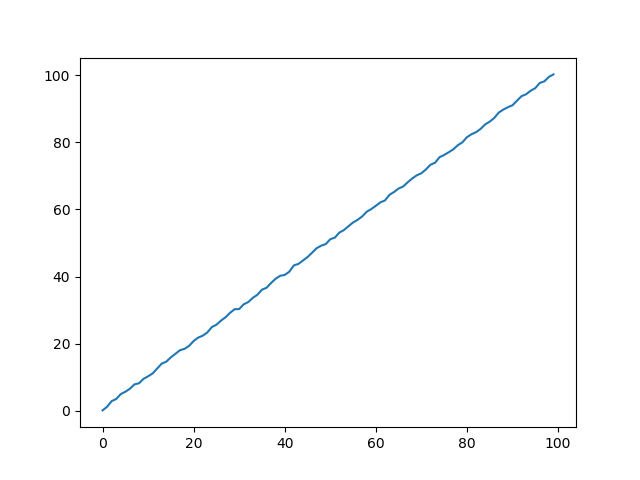
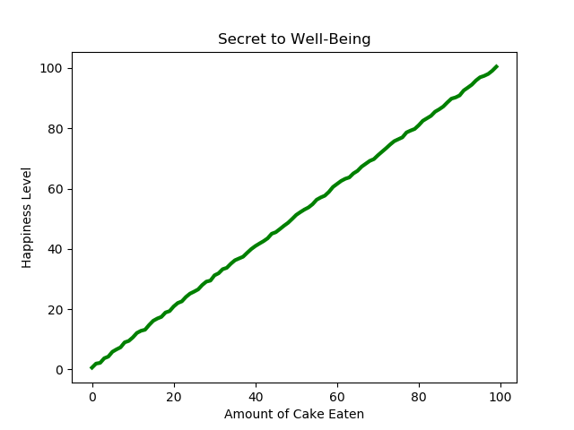
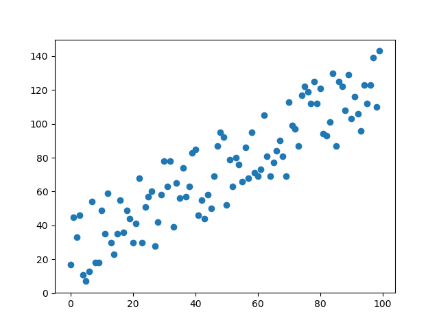
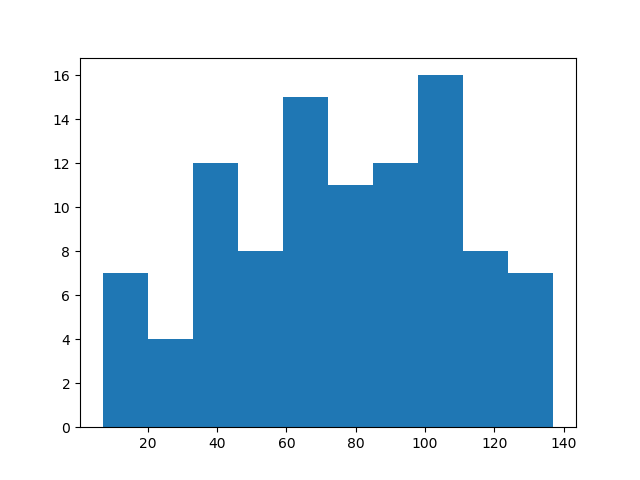

# Week 7 Exercises

# Thursday - Using Numpy and Matplotlib for Scientific Computing
This week is the introduction of two Python packages very popular in scientific computing - `numpy` for array and matrix manipulations and `matplotlib` for creating charts and graphs.

You can check if they have already been installed on your computer by starting an interactive Python shell and typing

```
import numpy
import matplotlib
```

If there aren't any errors printed, then they are installed. If there are errors, visit the [numpy installation documentation](https://scipy.org/install.html) and/or the [matplotlib documentation](https://matplotlib.org/3.1.1/users/installing.html).


## Working With Numpy Data Structures
1. Open the `exploring_numpy.py` file and follow the instructions in the comments.

2. Use the `test_exploring_numpy.py` file to test whether your functions work correctly. 

## Making Charts and Graphs
`matplotlib` is a very big collection of plotting tools. We will just focus on a subsection called `pyplot`. The function calls are modelled after the way plotting is done in Matlab, to make it easier to move between the two languages.

Make the following plots. Use the file `scientific_plotting.py` to write your code as it has the data already included that you will plot.

__NOTE__: The data you are using is being randomly generated, so your plots will differ slightly from the ones here and will differ slightly each time you run your code.

__ANOTHER NOTE__: Fonts and other graphical rendering details may differ according to factors such as your operating system. For example, the plots generated via running the code from VS Code are slightly different from those run from the Mac Terminal. You don't need to worry about these small differences.

1. Using the data generated by the `create_line_data()` function, create a line plot that looks similar to the one below.



2. Add title and labels to your line plot so that it is similar to the one below.



3. Using the data generated by the `create_scatter_data()` function, create a scatter plot that looks similar to the one below.



4. Using the data generated by the `create_scatter_data()` function, create a histogram with 10 bins that looks similar to the one below.

