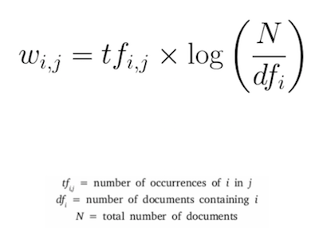

# Week 8 Thursday Exercises - Manipulating Text Files

## Navigating the File System

1. In an interactive Python shell, print out the list of files and folders in the folder where this README is located. (Should be the same as when you type `ls` on the command line.)

2. Either in the interactive shell or in a Python file if you want to save it, loop through the content of the folder `text_files` and print out the name of each file in the folder.

## Opening and Adding to a Text File

1. Write a Python script that opens the file `mercutio.txt` in the folder `text-files` and prints the first 10 lines. Pay attention to using good practice and using the `with` keyword as [described in the Python documentation](https://docs.python.org/3/tutorial/inputoutput.html#reading-and-writing-files_) otherwise make sure you correcly both open and close the file.

2. Open the `christmas-carol.txt` file and rewrite the ending. Remove the last set of paragraphs and replace the text with a new ending where Scrooge did not learn any lessons. Write out your new ending to the text file and then open it in a text editor to verify that your changes worked.


## Creating a New Text File

1. Write a Python script that creates a new file named the current time and date ([see the `time` module](https://docs.python.org/3/library/time.html)) which contains a description what you will do over the holidays and saves the file in the `text-files` folder (located in the same folder as this README).

## Putting Code Into Context - Natural Language Processing

When automatically analysing a text file to try and identify important concepts withint text, perhaps as part of [Natural Language Processing](https://becominghuman.ai/a-simple-introduction-to-natural-language-processing-ea66a1747b32) a common issue to address is how to figure out what the important keywords of a text are. There are wmany ords that are used repeatedly in any given text, but don't usually carry with them meaningful content and can get in the way of simple statistics about the text. For example, trying to determine the most commonly used word in order to infer the topic being discussed would be useless if the word 'the' was always returned as the answer.

Term Frequency - Inverse Data Frequency (TF-IDF) is a mathematical tool often used to address this issue. This exercise - which will extend through next week - will walk you through writing Python code that will read in a textfile and compute the TF-IDF described in the below equation. There are lots of further resources about this algorithm online, [I think this one is a good place to start.](http://www.tfidf.com/)




### Part 1 Term Frequency

Term Frequency measures how often a word appears in a document. It is the ratio of times that a term appears in a document (for us this will be a single file) compared to the total number of words in that document. By following the below steps, you will create a class that is instantiated by giving it a text file location. It will then read in that file and calculate the Term Frequency for all word in the file and save that in an attribute.

1. Create a new Python file in the same folder as this README called `tdidf.py`.

2. As a first step, in your new Python file create a class called `TfIdf`. For now create a constructor (`__init__` method) that creates an attribute called `docs_tf` that is an empty dictionary and then returns nothing. This will just be a placeholder for now. You'll return to it later.

3. Add a method to the class called `read_file()` that takes in a string that is a path to a text file. The method reads in the file and returns a string of the contents.

4. Add a method to the class called `string_to_list()` that takes in a single string and returns a list of all the words that were in that string. Make sure all whitespace is removed and all the words in the list are lowercase. You may find [looking through the string methods](https://docs.python.org/3.8/library/string.html) useful.

5. Run the test file `test-tfidf.py` to check that your function works correctly.

6. Next write a function that calculates the TF for all words in a given list of strings. Inside your class, create a function called `compute_tf()` that takes in a string and returns a dictionary where each key is a word that appears in the string and the associated value is the number of times that word appeared.

7. Run the test file `test-tfidf.py`, uncommenting the function `text_tf()` to check that your function works correctly.

__HINT:__ You can comment/uncomment multiple lines at the same time by highlighting them, then going to `Edit->Toggle Line Comment` in VS Code. There is also a keyboard shortcut listed in the menu you can use instead.

8. Now edit your `__init__` method in your class so that it accepts an input argument of a string of a path name to one of the example text files in the `text-files` folder. Have it:

    * Use `read_file()` to read in the text.

    * Then call `string_to_list()` to create a list of words from that text.

    * And last compute the TF of the generated list and save it in the `tf` attribute for the class.

9. In the interactive shell you should now be able to import the module, create an instance of the class pointing at a particular file, and then print the attribute `tf` to see the calculated terms and their frequencies - all in three lines of code like the following.

```
import tfidf as t
my_t = t.TfIdf('./text-files/a-drinking-song-yeats.txt')
my_t.tf
```


Next Tuesday you will do Part 2 and build on this code to complete the TF-IDF computation. We will go over the Part 1 code together in Tuesday's lecture, so make sure you have completed these steps before then to get the best use of the session.

