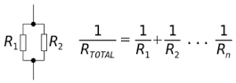

# Week 8 Tuesday Exercises - Creating and Using Classes

## Using and Editing a Class

Resistors are electrical components used in just about all basic circuits. They are measured in Ohms and come packaged in different values. Their values are encoded on them as coloured stripes which can be used to compute the target resistance of the resistory +/- a percentage tolerance. The web is full of calculators that determine the value for you, such as [this one by Digi-Key](https://www.digikey.co.uk/en/resources/conversion-calculators/conversion-calculator-resistor-color-code-4-band).

Read through the `resistor.py` file which is the start of a class representing a signal resistor.

1. Create two different instances of `Resistor` with colours `brown black red silver` and `red red red brown gold`. Call the `value()` method for each to print their resistances.

2. Edit the `__init__` method so that the strings passed as input arguments are all lowercase. In other words, if someone enters `Red` as a colour string, it will be saved as `red`.

3. Finish the two methods that have been started in the file, `min_value()` and `max_value()` so that they return the minimum and maximum values.

4. Create a file called `parallel.py` which contains a method called `parallel_pair()` that takes in two instances of a resistor and returns the resistance value of them in a parallel circuit. The equation for calculating the resistance of two resistors in parallel is:



For example, you would call the function with the following code:

```
my_resistor1 = Resistor('red', 'red', 'brown', 'gold')
my_resistor2 = Resistor('yellow', 'orange', 'black', 'silver')
total_resistance = parallel_pair(my_resistor1, my_resistor2)
```

5. This an extra challenging exercise: add another method called `parallel_resistance()` that takes an arbitray number of arguments, each an instance of `Resistor`, and returns the resistance value of the resulting parallel circuit using the same equation shown above. Look into a Python concept called arbitrary arguments. It's decribed in detail starting on page 554 of Learning Python by Lutz.


## Creating a New Class

Let's start the code for how you might design a system to manage DesEng students using materials in a making space. We will create a class to represent a single student, assigning them a starting budget along with capturing some basic information. We will then add a helper method to deduct an amount of money of their budget and three methods each which call the helper method to deduct a specific cost.

1. Create a file in the same folder as this README file called `student.py`

2. Within that file create a class called `DesEngStudent`. The constructor sets the following attributes using keyword arguments:

* `name` (string)
* `year` (integer)
* `budget` (float)

    For example, you might create the following student:
    
    `my_student = DesEngStudent(name='Peter Cheung', year=3, budget=100)`

3. Add a method that returns a string with the student information.

    For example:
    
    `my_student.print()`

    Would return:
    `Peter Cheung (DE3) with £100 remaining`

4. Add a method called `spend()` that deducts from the budget the amount specified in the argument and returns the amount remaining in the budget. If the requested amount to spend is more than the remaining budget, they raise a `ValueError` exception.

    For example:

    `my_student.spend(3.50)`

    Would return:
    `96.5`

5. Add three methods `three_d()`, `paper_print()`, and `laser_cut()` that each call `spend()` to deduct a specific amount from the budget. Each method takes a single input (a quantity of units), and for each unit the following is deducted from the budget:

* `three_d()` - one unit costs £5.50
* `paper_print()` - one unit costs £0.10
* `laser_cut()` - one unit costs £1.00

6. Test that the class works as expected with the test file `test_student.py`.
